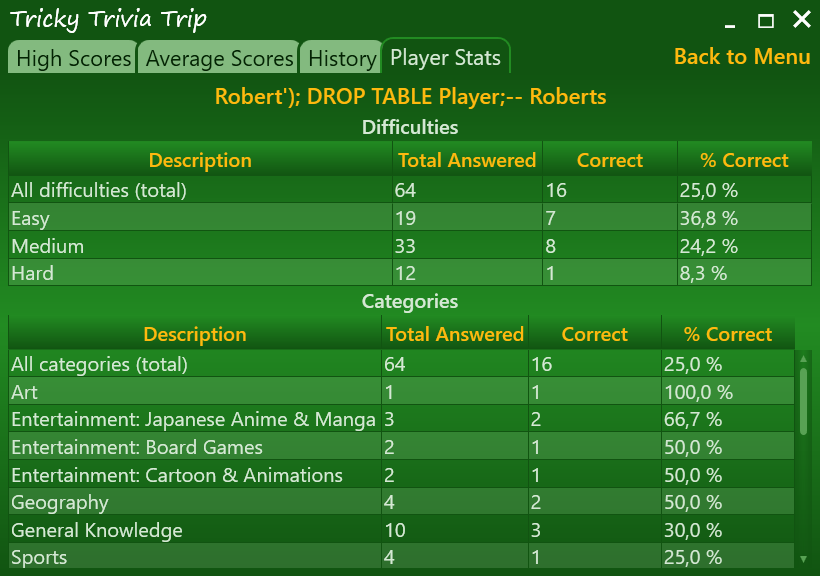

# Tricky Trivia Trip

This is a simple trivia game that uses the Open Trivia Database API and allows players to answer multiple-choice questions. Player scores, game history, and trivia questions are stored in an SQLite database using ADO.NET.


## Technical highlights
- Question queue with automatic background replenishment from the API, as well as the ability to fall back to the database in the event of an API connection issue
- Fully asynchronous API and database operations
- MVVM architecture with clean separation of concerns
- Normalized relational database schema
- Game statistics using fairly complex SQL queries
- Logging in a background thread with communication via `BlockingCollection`
- Extensive use of WPF control templates to achieve a non-standard UI appearance and an optimal user experience

## Gameplay
The gameplay is as simple as it gets. The player answers ten random trivia questions. Each game concludes with basic score statistics. The player can also view the leaderboard and more detailed all-time statistics.


## Database
I chose SQLite for this project because it's lightweight, easy to set up, and doesn't require a separate database server. This makes it easy to run the game without additional setup. All the necessary DLLs are already included, and the database is created when the application is first launched (in `C:\Users\{Username}\AppData\Local\TrickyTriviaTrip`).

When I was designing the database, one of the most interesting decisions was how to store questions and answer options. The goal of the design was to avoid data duplication, ensure data integrity, and make the structure easy to query and maintain. In other words, I tried to achieve a high level of normalization. Storing all answer options together with the question would violate even 1NF, which states that "each field is atomic, containing a single value rather than a set of values". In such a database, it would be difficult to even record which option the player chose, especially since the order of the answer options is randomized.

Thus, it was necessary to store the answer options separately from the questions, in a dedicated table. But how to store which answer option is correct? I could add a `CorrectOptionId` field to the `Question` table. However, this would create a circular dependency during insertion because, to insert a question with all the answers into the database, I would need to:

1. Insert the question first (but the correct option ID is yet unknown).
2. Insert the answer options and get their IDs.
3. Go back and update the question with the ID of the correct option.

I preferred the idea of using a boolean `IsCorrect` flag in `AnswerOption`. With this approach, each option "knows" whether it's correct. Inserting into the database is also easier because the question does not need to be updated with the ID of the correct option. However, without proper enforcement, multiple answer options could be marked as correct. Fortunately, enforcing it wasn't difficult:

```sql
-- Partial unique index that guarantees that there is only one correct answer per question
CREATE UNIQUE INDEX OneCorrectAnswerPerQuestion ON AnswerOption(QuestionId)
WHERE IsCorrect = 1;
```

---




Thanks to this project, I have a better understanding of SQL now. For example, to get the data for one of the tables on the screenshot above, one could use this query:

```sql
SELECT q.Category AS Category,
    COUNT(*) AS TotalAnswered,
    SUM(ao.IsCorrect) AS CorrectlyAnswered,
    ROUND(
        1.0 * SUM(ao.IsCorrect) / COUNT(*),
        2
    ) AS CorrectPercentage
FROM AnswerAttempt aa
    JOIN Question q ON aa.QuestionId = q.Id
    JOIN AnswerOption ao ON aa.AnswerOptionId = ao.Id
WHERE aa.PlayerId = ?
GROUP BY q.Category
ORDER BY CorrectPercentage DESC;
```

The same COUNT and SUM operations are repeated twice here because SQL can't reference aliases within the same SELECT clause. I optimized the query by using a nested SELECT clause:

```sql
SELECT Category,
    TotalAnswered,
    CorrectlyAnswered,
    1.0 * CorrectlyAnswered / TotalAnswered AS CorrectPercentage
FROM (
        SELECT q.Category AS Category,
            COUNT(*) AS TotalAnswered,
            SUM(ao.IsCorrect) AS CorrectlyAnswered
        FROM AnswerAttempt aa
            JOIN Question q ON aa.QuestionId = q.Id
            JOIN AnswerOption ao ON aa.AnswerOptionId = ao.Id
        WHERE aa.PlayerId = @PlayerId
        GROUP BY q.Category
    )
ORDER BY CorrectPercentage DESC;
```


## Fun with UI

### The invisible grid

Creating a UI in WPF is always satisfying because WPF is so powerful. Implementing complex design ideas can be surprisingly easy. However, seemingly simple things can suddenly turn out to be unexpectedly difficult.

For example, I display answer options for a question in a ListBox. Each option allows text wrapping, meaning their height is not known in advance. The same goes for the height of the question, which is displayed above the ListBox. I wanted the ListBox to use its ScrollViewer if there is not enough vertical space. And if there is too much vertical space, then the ListBox was supposed to stay modestly in the center, taking up exactly as much space as it needs, without spreading out in height.

As it turned out, this was not so easy to achieve. When you set the height of the ListBox's row in the grid to "Auto," it behaves perfectly when there is extra space. However, when there is insufficient space, rather than using its ScrollViewer, the ListBox simply stretches outside the screen. This is how the Auto height setting works: the element takes exactly as much space as it needs, even if that means exceeding the available window size.

I couldn't achieve a satisfactory result with proportional sizing either, since the space above and below the main content had to be taken up by empty rows, also sized proportionally. This would either squeeze the ListBox too much when there wasn't enough space or leave too much space in the opposite case.

The "head-on" solution, where the height or maximum height of the ListBox is calculated manually in some way (for example, via a converter) seemed inelegant to me.

After a bit of thinking, I found a great solution. I set `Height="Auto"` for the ListBox row. At the same time I created an invisible twin of my grid, but without the empty rows at the top and bottom. This invisible grid has the same question at the top with a binding to the same question text, as well as a Next Question button, while the rest of the space is taken up by an element with `x:Name="SpaceLeft"`.

After that, in the ListBox I set `MaxHeight="{Binding ActualHeight, ElementName=SpaceLeft}"`, and the problem was solved. If there is too much space, the ListBox takes up exactly as much as it needs thanks to `Height="Auto"`, and if there is too little space, the ListBox gets its maximum height from the invisible grid and never tries to take more space than is actually left, and so it turns on its ScrollViewer.

### DataGrid's column headers
I had to recreate the control template for the header, so I decided to animate it a bit. After all, it's a game, not a serious app. Nevertheless, I tried to keep it subtle and unostentatious.


I'm not exaggerating when I write that I *had to* recreate the control template. In WPF, I often find myself recreating control templates, even when I'm only trying to change the style and not the behavior of a control. In this case, I just wanted to change the background color. This was the silliest case of all because DataGrid is actually not so bad. It allows for quite a lot of style customization without recreating templates. Everything went well until I got to the header background color. As soon as you change the background color, the template resets, and the header loses all its visual features, particularly the separators and arrows that indicate the sorting direction.

This seemed so random that I had to look into it, and sure enough, people had noticed it before. There's even [an official answer from Microsoft](https://developercommunity.visualstudio.com/t/Unable-to-override-default-DataGridColum/10419063). "This is by design" ¯\\_(ツ)_/¯

But it all turned out for the best. I had some fun and learned how to use `VisualStateManager.VisualStateGroups`.

## Conclusion
It was a fun project, and I learned some new things.

---

## Installation and running
### Option 1: Download and run (Windows 7+)
1. Download the latest release from the [GitHub Releases page](https://github.com/the-corg/tricky-trivia-trip/releases).
2. Extract the zipped folder.
3. Run the `.exe` file.
4. If prompted, download and install .NET Desktop Runtime.

### Option 2: Clone and build (.NET 8+)
1. Clone this repository.
```sh
git clone https://github.com/the-corg/tricky-trivia-trip.git
```
2. Open the solution in Visual Studio and run the project.

There are two dependencies:
**Microsoft.Extensions.DependencyInjection** and **System.Data.SQLite.Core**.
If NuGet Package Restore doesn't work automatically, you might need to install these manually.


## Links

- [Pudelwohl](https://github.com/the-corg/pudelwohl) is my earlier WPF demo project about managing a dog hotel.

